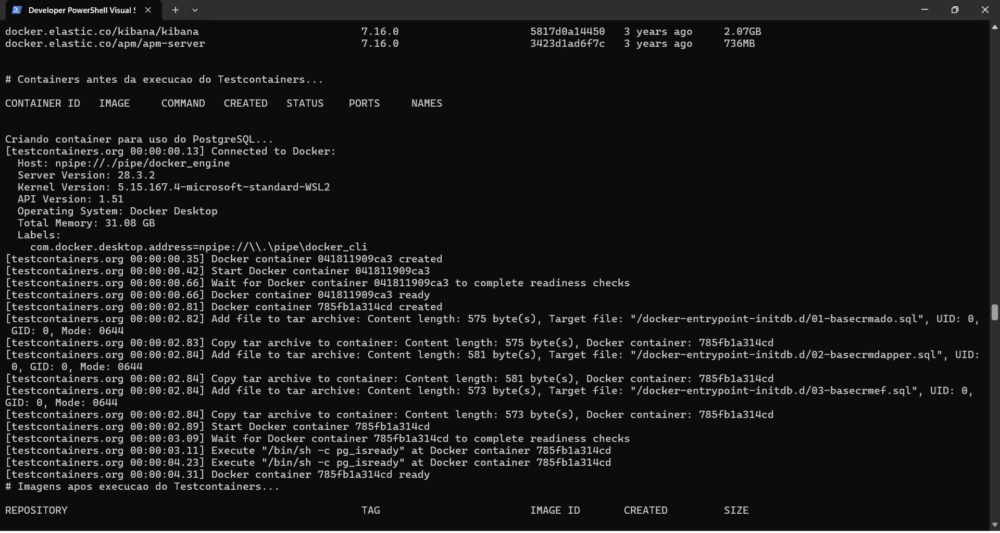
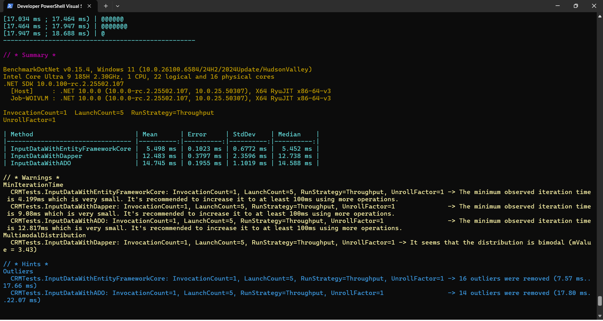
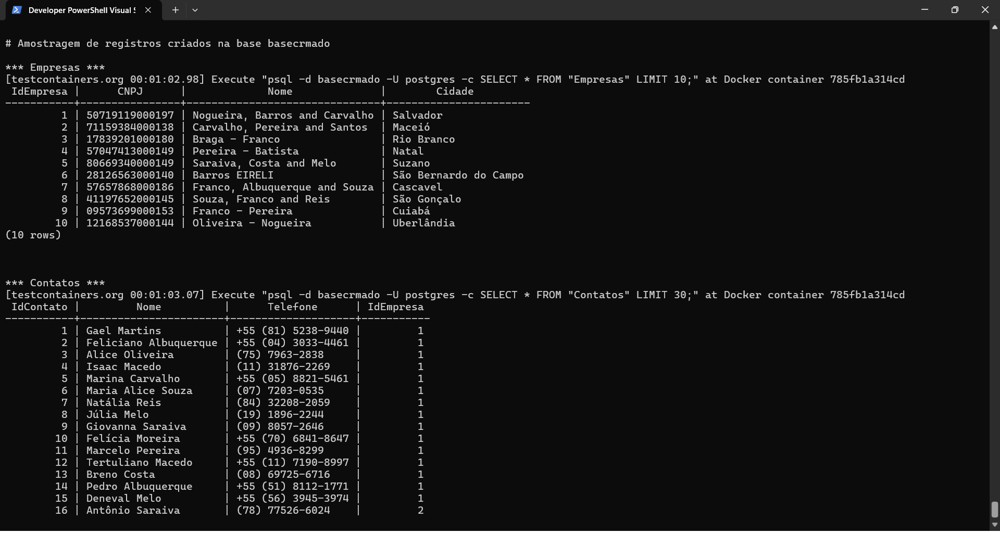
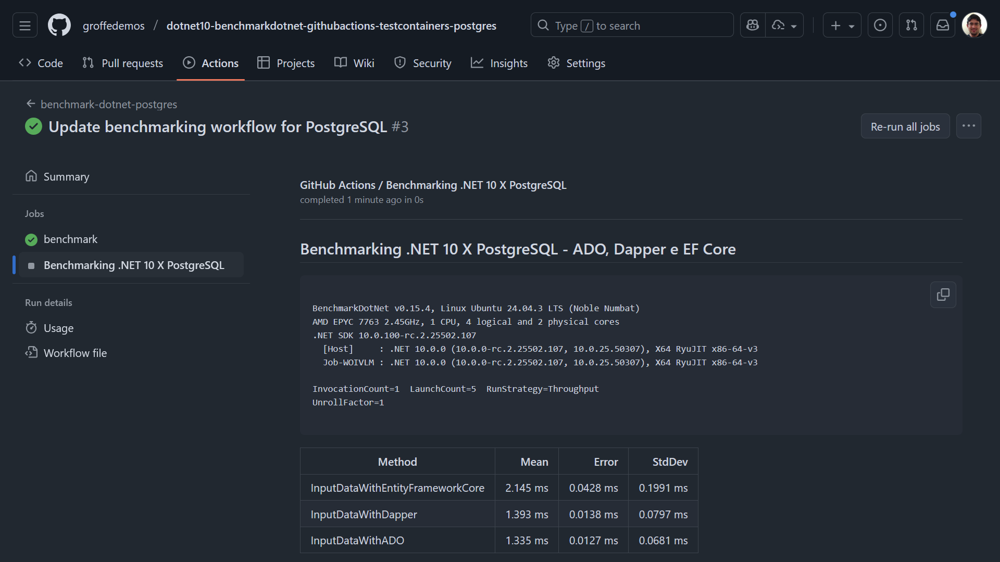

# dotnet10-benchmarkdotnet-githubactions-testcontainers-postgres
Workflow do GitHub Actions utilizando BenchmarkDotNet para avaliar a performance na inclusão de registros + Aplicação de testes que faz uso de .NET 10, Testcontainers, PostgreSQL, Dapper, ADO e Entity Framework Core.

---

Inicialização do container:

Um dos possíveis resultados (15 registros de contatos por empresa):

Outro dos possíveis resultados (2 registros de contatos por empresa):

Alguns dados fake gerados como resultados dos testes:

Um possível resultado da execução do workflow do GitHub Actions:

